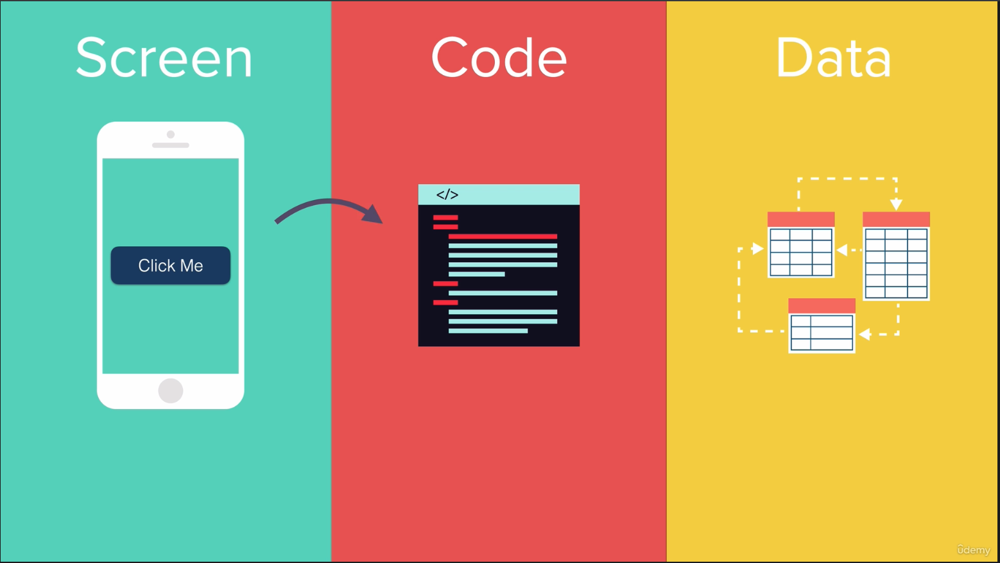

= iOS & Swift - The Complete iOS Apps Development Bootcamp

== Links

- https://www.swift.org/documentation/[Swift Docs]
- https://github.com/appbrewery[Github AppBrewery]
- https://medium.mybridge.co/21-amazing-open-source-ios-apps-written-in-swift-5e835afee98e[21 Amazing Open Source iOS Apps Written in Swift]
- https://www.hackingwithswift.com/articles/258/whats-new-in-swift-5-9[What's new in Swift 5.9]

.Basic interaction between layers in App

[source, swift]
----

import UIKit

class ViewController: UIViewController {
	
	override func viewDidLoad() {
		super.viewDidLoad()
	}

}

----

== Swift Data Structures Concepts

. Compose by Array, Dicts and Sets

[source, swift]
----
// array
let people = ["Jon", "Marie"]
people[0] // means Jon
people.append("XPTO")
people.insert("XPTX", at: 0)
// dict
var scores: [String: Int] = ["Eric":9]
scores["New Person"] = 22 // no order garantees
var bag: Set<String> = ["One", "Two"]
print(bag)
----

=== Stack and LinkedList

[source, swift]
----
struct Stack<T>: CustomDebugStringConvertible {
  private var items: [T] = []
  public init() {}
  public var debugDescription: String {
    """
    ----top----
    \(items.map{"\($0)"}.reversed().joined(separator: "\n"))
    -----------
    """
  }

  mutating func push(_ element: T) {
    items.append(element)
  }

  @discardableResult
  mutating func pop() -> T? {
    if items.isEmpty { return nil }
    return items.popLast()
  }

}

// Linked List

class Node<T>: CustomStringConvertible {
  public var value: T
  public var next: Node?

  public init(value: T, next: Node? = nil) {
    self.next = next
    self.value = value
  }
  
  public var description: String {
    guard let next = next else {
      return "\(value)"
    }
    return "\(value) -> " + String(describing: next) + " "
  }
}

var stack = Stack<Int>()

stack.push(1)
stack.push(2)

print(stack)

let node1 = Node(value: 1)
let node2 = Node(value: 2)

node1.next = node2

print(node1)

----

.Guard Expression
[source, swift]
----
guard true else {
  print("Will Not printed")
}
print("This will be printed")

guard false else {
  print("This will be printed")
}
print("Will Not printed")
----